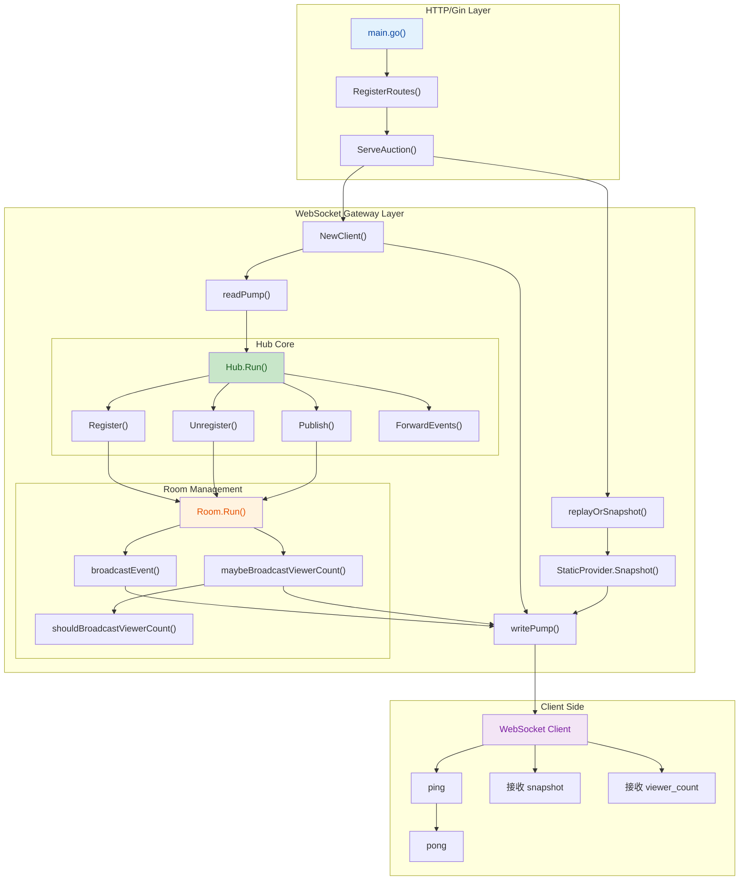
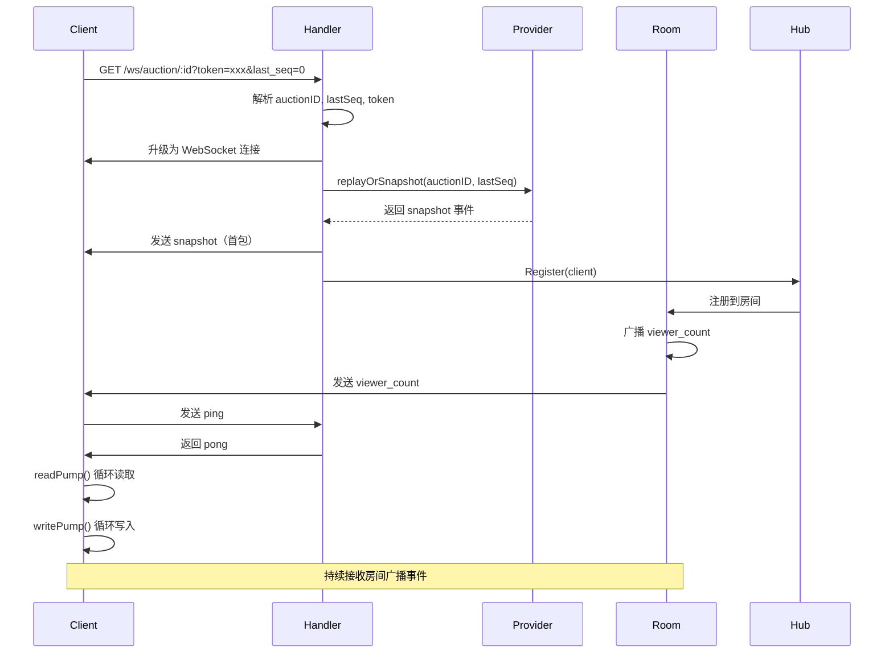

## 1. 高层摘要（TL;DR）

*   **影响范围：** 🟡 **中等** - 完成了直播竞拍系统的 WebSocket 实时网关骨架，为移动端直播间提供基础连接能力
*   **核心变更：**
    *   ✅ 新增 `Hub/Room/Client` 三层架构的 WebSocket 网关
    *   ✅ 实现 `/ws/auction/:id` 实时连接入口，支持房间隔离
    *   ✅ 支持 `snapshot` 首包、`ping/pong` 心跳、`viewer_count` 广播
    *   ✅ 新增完整的工作报告文档和 Role B 开发指南
    *   ✅ 提供自动化测试覆盖关键场景

---

## 2. 可视化架构概览

### 2.1 WebSocket 网关架构图



### 2.2 连接生命周期时序图



---

## 3. 详细变更分析

### 3.1 后端核心模块（Go）

#### 📁 **Hub 核心层** (`server-go/internal/realtime/hub.go`)

**职责：** WebSocket 网关的总入口，管理所有拍卖房间

**核心方法：**
| 方法名 | 功能描述 |
|--------|----------|
| `NewHub(provider)` | 创建 Hub，支持 Provider 注入 |
| `Run(ctx)` | 主循环，处理注册/注销/发布事件 |
| `Register(client)` | 注册客户端到对应房间 |
| `Unregister(client)` | 从房间注销客户端 |
| `Publish(event)` | 发布事件到指定房间（供 Role A 的 outbox publisher 调用） |
| `ForwardEvents(ctx, ch)` | 桥接 channel 或 Redis pub/sub 事件流 |
| `replayOrSnapshot()` | 根据 last_seq 决定返回补偿事件或 snapshot |

**关键设计：**
- 使用 channel 实现并发安全的客户端注册/注销
- 按 auction_id 自动创建和管理房间
- 预留了与 Redis pub/sub 对接的接口

---

#### 📁 **房间管理层** (`server-go/internal/realtime/room.go`)

**职责：** 管理单个拍卖房间的连接和广播

**核心方法：**
| 方法名 | 功能描述 |
|--------|----------|
| `NewRoom(auctionID)` | 创建房间实例 |
| `Run()` | 房间主循环，处理注册/注销/广播/定时任务 |
| `broadcastEvent(event)` | 向房间内所有客户端广播事件 |
| `maybeBroadcastViewerCount(now)` | 节流广播在线人数 |
| `shouldBroadcastViewerCount(current)` | 判断是否需要广播（≥2% 变化） |

**viewer_count 节流策略：**
```go
// 最小间隔：2 秒
// 变化阈值：≥ 2% 或从 0 开始
const viewerCountInterval = 2 * time.Second
```

**重要说明：**
- `viewer_count` 是**软事件**，不推进业务 seq
- 客户端不应因 `viewer_count` 缺失触发 `/events` 补偿

---

#### 📁 **客户端连接层** (`server-go/internal/realtime/client.go`)

**职责：** 处理单个 WebSocket 连接的读写循环

**核心方法：**
| 方法名 | 功能描述 |
|--------|----------|
| `NewClient()` | 创建客户端实例 |
| `readPump()` | 读取循环：处理 ping/ack，60秒超时断开 |
| `writePump()` | 写入循环：从 send channel 读取并发送 |
| `enqueueEvent(event)` | 将事件加入发送队列 |

**心跳机制：**
```go
const (
    pongWait = 60 * time.Second  // 读超时
    writeWait = 10 * time.Second // 写超时
)
```

---

#### 📁 **HTTP 路由层** (`server-go/internal/realtime/handler.go`)

**职责：** 处理 WebSocket 握手和升级

**路由定义：**
```go
GET /ws/auction/:id?token=<token>&last_seq=<seq>
```

**处理流程：**
1. 解析 `auction_id` 参数
2. 解析可选 `last_seq` 参数
3. 读取 `token`（TODO: 生产环境需替换为 JWT）
4. 升级 HTTP 连接为 WebSocket
5. 创建 Client 实例
6. 先发送 snapshot 或补偿事件
7. 注册到房间
8. 启动读写循环

**CORS 白名单：**
- `http://localhost:5173`
- `http://localhost:5174`
- `http://127.0.0.1:5173`
- `http://127.0.0.1:5174`

---

#### 📁 **事件定义层** (`server-go/internal/realtime/event.go`)

**事件类型：**

| 事件类型 | 方向 | 说明 |
|----------|------|------|
| `snapshot` | 服务端→客户端 | 房间初始状态快照 |
| `viewer_count` | 服务端→客户端 | 在线人数变化（软事件） |
| `ping` | 客户端→服务端 | 心跳请求 |
| `pong` | 服务端→客户端 | 心跳响应 |

**EventEnvelope 结构：**
```go
type EventEnvelope struct {
    Type       string          // 事件类型
    EventID    string          // 事件唯一ID
    AuctionID  int64           // 拍卖ID
    Seq        int64           // 业务序号（viewer_count 为 0）
    ServerTime string          // 服务器时间（RFC3339Nano）
    Data       json.RawMessage // 事件数据
}
```

---

#### 📁 **Provider 抽象层** (`server-go/internal/realtime/provider.go`)

**接口定义：**

| 接口 | 方法 | 说明 |
|------|------|------|
| `SnapshotProvider` | `Snapshot(ctx, auctionID)` | 获取房间快照 |
| `ReplayProvider` | `EventsAfter(ctx, auctionID, afterSeq, limit)` | 获取补偿事件 |
| `Provider` | 继承上述两个接口 | 组合接口 |

**当前实现：**
- `StaticProvider` - 占位实现，返回固定 snapshot
- 后续 Task E 将替换为真实的 `/status` 和 `/events` 实现

---

#### 📁 **测试覆盖** (`server-go/internal/realtime/realtime_test.go`)

**测试用例：**

| 测试用例 | 验证内容 |
|----------|----------|
| `TestHubPublishBroadcastsOnlyMatchingRoom` | 房间隔离：事件只广播到对应房间 |
| `TestHubSendsViewerCountSoftEvent` | viewer_count 软事件不推进业务 seq |
| `TestReplayFallsBackToSnapshot` | 补偿失败时回退到 snapshot |
| `TestServeAuctionSendsSnapshotThenPong` | 首包为 snapshot，ping 后返回 pong |

**测试结果：**
```text
ok   auction-system/server-go/internal/realtime
```

---

### 3.2 文档与配置

#### 📄 **Role B 开发指南** (`mobile-h5/README.md`)

**新增内容：**
- Role B 的 4 大核心职责说明
- 5 阶段开发流程（从 mock 到联调）
- 优先级排序和任务清单
- 文档查阅索引

**核心职责：**
1. 移动端 H5 基础
2. 实时 WebSocket 网关
3. 状态与补偿接口（`/status`、`/events`）
4. 上传接口（`/api/uploads`）

---

#### 📄 **Prompt 模板** (`mobile-h5/role-B-realtime-mobile.md`)

**包含 6 个场景模板：**
1. **场景 1：** WS 网关骨架（本次实现）
2. **场景 2：** `/events` 补偿接口（下一阶段）
3. **场景 3：** 移动端直播间页面
4. **场景 4：** 弱网与重连策略
5. **场景 5：** 上传接口
6. **场景 6：** 出价提醒和氛围

**反模式清单：**
- ❌ 用本地 `Date.now()` 计算倒计时
- ❌ 用 `setInterval` 重发 ping
- ❌ 出价成功立即更新本地 leader
- ❌ 用 socket.io
- ❌ viewer_count 缺失触发补偿

---

#### 📄 **工作报告** (`LSH_工作报告/Part1_WS网关骨架工作报告.md`)

**结构化报告包含：**
1. 完成的业务逻辑
2. 工作背景
3. 本次交付结论
4. 涉及文件
5. 技术实现说明
6. 事件协议处理
7. 验收记录
8. 当前限制
9. 风险与评审意见
10. 后续计划
11. 本阶段评审结论

---

#### 📄 **评审技能文档** (`LSH_工作报告/work-report-review/SKILL.md`)

**定义工作报告的标准结构和写作规范：**
- 11 个标准章节
- 证据驱动的写作原则
- 所有权边界说明
- 可执行的后续计划

---

### 3.3 主程序集成

#### 📄 **server-go/main.go**

**变更内容：**
```go
// 新增导入
import (
    "context"
    "auction-system/server-go/internal/realtime"
)

// main 函数中新增
func main() {
    r := gin.Default()
    
    // 创建并启动 Hub
    hub := realtime.NewHub(nil)
    go hub.Run(context.Background())
    
    // ... CORS 配置 ...
    
    // 注册 WebSocket 路由
    realtime.RegisterRoutes(r, hub)
    
    r.Run(":8080")
}
```

---

## 4. 影响与风险评估

### ⚠️ **当前限制**

| 限制项 | 说明 | 影响 |
|--------|------|------|
| 占位 Snapshot | `StaticProvider` 返回固定数据 | 移动端无法看到真实拍卖状态 |
| 未实现 `/events` | 补偿接口尚未实现 | 断线重连无法补齐缺失事件 |
| 未接入 Redis | 单实例运行 | 多实例部署时房间状态不同步 |
| 弱鉴权 | 仅通过 query 传递 token | 生产环境需替换为 JWT |
| 未接入数据库 | 无 MySQL/Redis 连接 | 无法读取真实拍卖数据 |

---

### 🔍 **风险点**

#### 1. **事件序号口径风险**
- **问题：** `contract-v2.md` 中曾出现 "viewer_count 的 seq 仍参与全局自增" 的表述
- **当前实现：** viewer_count 不推进补偿游标（seq=0）
- **建议：** 团队统一口径，避免前端补偿逻辑歧义

#### 2. **数据源替换风险**
- **问题：** `StaticProvider` 只是临时占位
- **影响：** Task E 必须补齐真实 provider，否则移动端只能看到占位数据

#### 3. **多实例广播风险**
- **问题：** 提供了 `ForwardEvents()` 接口但未接 Redis pub/sub
- **影响：** 单实例演示可用，多实例部署需补齐 Redis 订阅与发布

---

### ✅ **测试建议**

#### 自动化测试
```bash
cd D:\TRAEProj\auction-system\server-go
go test ./...
```

#### 手工验收（浏览器控制台）
```javascript
const ws = new WebSocket(
  "ws://localhost:8080/ws/auction/1?token=mock-token-user-001&last_seq=0"
);

ws.onmessage = (e) => console.log("WS:", JSON.parse(e.data));
ws.onopen = () => ws.send(JSON.stringify({ type: "ping" }));
```

**预期输出：**
1. 首包：`snapshot` 事件
2. 心跳：`pong` 响应
3. 广播：`viewer_count` 事件

---

## 5. 后续计划

### 🎯 **下一阶段：场景 2 - `/events` 补偿接口**

**优先任务：**
1. 实现 `GET /api/auctions/:id/events?after_seq=&limit=`
2. 从 `event_outbox` 查询 `event_seq > after_seq` 的事件
3. 返回 `has_more` 和 `snapshot_required`
4. 过滤或排除 `viewer_count` 软事件
5. 将 `StaticProvider` 替换为真实 provider
6. 让 WS 重连时携带 `last_seq` 后能够补发缺失事件

**集成点：**
- 与 Role A 的 `event_outbox` 表对接
- 与前端 `ConnectionManager` 的弱网恢复逻辑对接

---

## 6. 总结

本次变更完成了 **WebSocket 网关骨架** 的核心实现，包括：

✅ **架构设计：** Hub/Room/Client 三层结构，清晰分离职责  
✅ **房间隔离：** 按 auction_id 独立管理，避免消息串扰  
✅ **事件协议：** 支持 snapshot、ping/pong、viewer_count  
✅ **扩展预留：** Provider 抽象、Redis pub/sub 接口、outbox publisher 对接  
✅ **测试覆盖：** 4 个关键场景的自动化测试  
✅ **文档完善：** 结构化工作报告、Role B 开发指南、Prompt 模板  

当前实现为**骨架版本**，适合作为后续实时竞拍链路的基础。下一阶段需要接入真实的 `/status` 和 `/events` 接口，实现完整的弱网恢复能力。

---

**评审结论：** ✅ 通过 - 本阶段已完成 Role B WebSocket 网关骨架，满足场景一验收要求，结构上保留了与后续模块的对接空间。