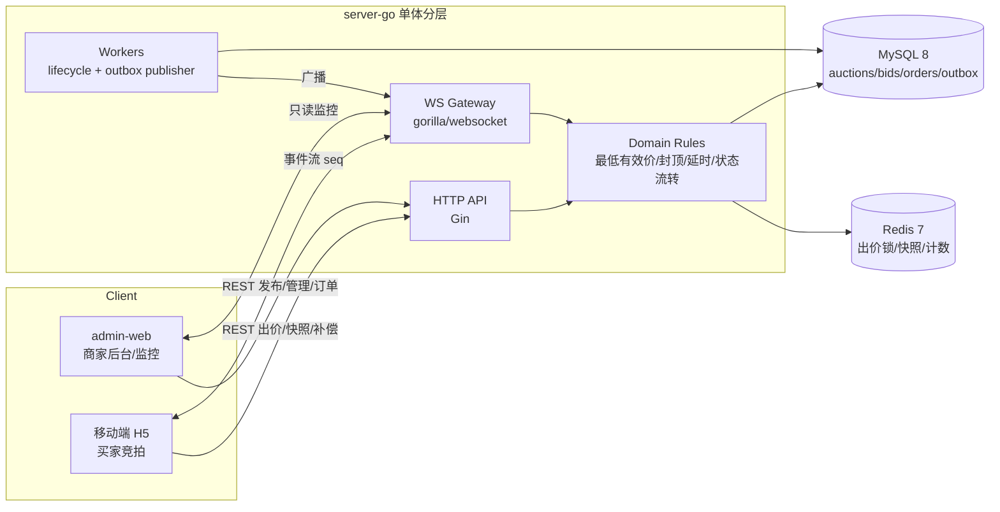
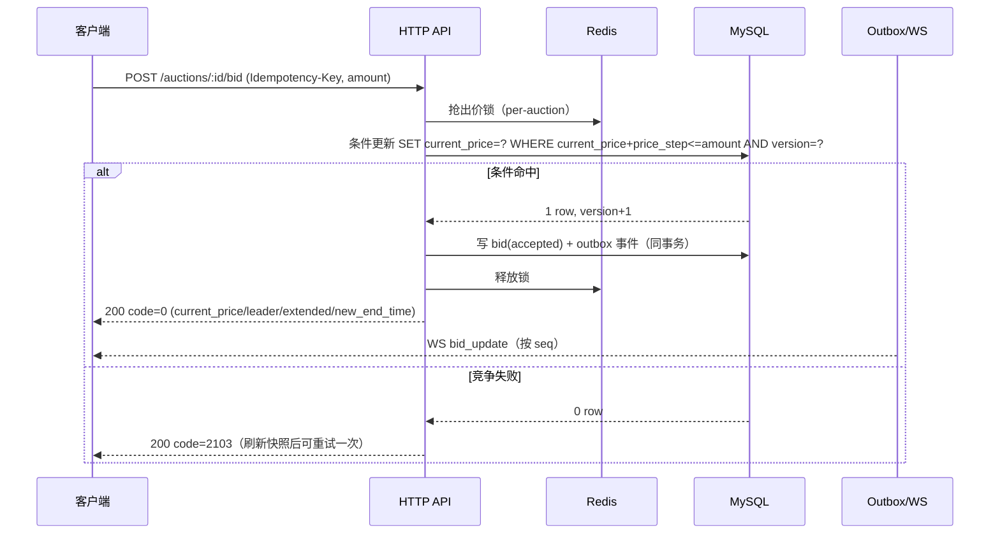
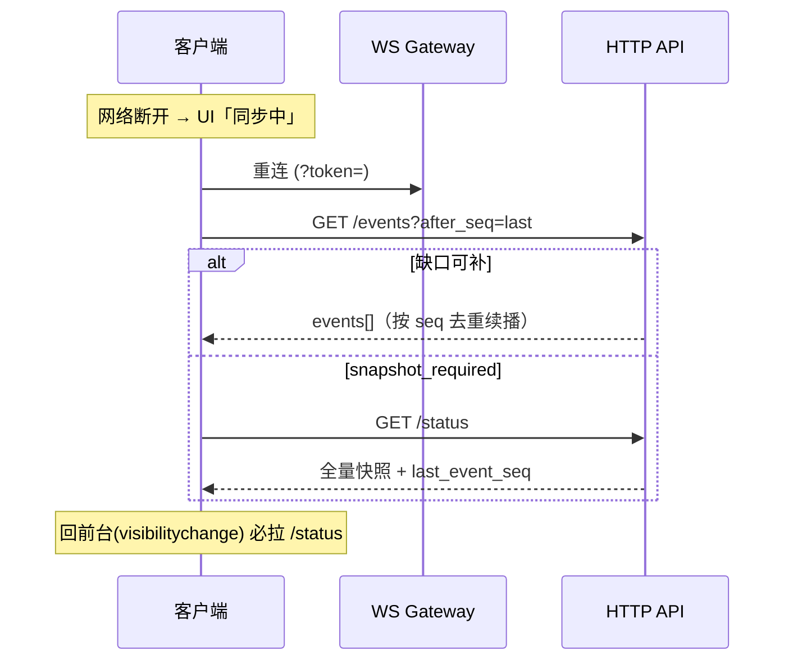

# 直播电商实时竞拍系统 · 项目方案文档

> 课题：抖音电商 AI 全栈课题 · 直播竞拍全栈系统
> 版本：v1.0 · 2026-06-10

---

## 目录

1. [项目概述](#1-项目概述)
2. [系统架构](#2-系统架构)
3. [技术栈](#3-技术栈)
4. [核心模块设计](#4-核心模块设计)
5. [接口协议](#5-接口协议)
6. [WebSocket 事件体系](#6-websocket-事件体系)
7. [数据库设计要点](#7-数据库设计要点)
8. [团队分工](#8-团队分工)
9. [里程碑与时间线](#9-里程碑与时间线)
10. [工程化方案](#10-工程化方案)
11. [技术亮点汇总](#11-技术亮点汇总)

---

## 1. 项目概述

### 1.1 一句话价值

0 元起拍、实时竞价、延时反超的端到端直播竞拍系统——支持买家移动端实时出价、商家 PC 端发布管理、WebSocket 毫秒级推送与弱网自动恢复。

### 1.2 核心业务流程

```
商家发布拍卖
    ↓
等待开始时间（pending）
    ↓  [Lifecycle Worker]
拍卖开始（active）→ WS 广播 auction_started
    ↓
买家出价（bid）→ Redis 锁 + MySQL 条件更新 → WS 广播 bid_update
    ↓  [最后 N 秒内出价]
延时倒计时（extend）→ WS 广播 auction_extended
    ↓  [超时或封顶成交]
拍卖结束（ended）→ WS 广播 auction_ended → 自动建单
    ↓
买家支付（order）
```

### 1.3 竞拍规则

| 规则 | 说明 |
|---|---|
| 起拍价 | `start_price = 0` 即 0 元起拍；首笔最低有效价 = `start_price + price_step` |
| 加价幅度 | 每次出价 ≥ `current_price + price_step` |
| 封顶成交 | 出价 ≥ `ceiling_price` 时立即结束，出价方成交 |
| 延时规则 | 距结束 ≤ `extend_threshold` 秒内有效出价，结束时间延后 `extend_seconds` 秒（可叠加） |
| 流拍 | 无任何有效出价则流拍，不建单 |

---

## 2. 系统架构

### 2.1 总体架构



### 2.2 分层架构

```
HTTP/WebSocket Transport
        ↓
  Application Service       ← 事务编排、幂等编排、outbox 写入
        ↓
    Domain Rules             ← 竞拍规则（可单元测试）
        ↓
  Repository / Storage      ← MySQL 事务 + Redis 访问
```

**各层职责约束：**

- **Transport 层（Gin Handler）**：只负责鉴权上下文读取、参数绑定、错误映射和响应，不写核心业务规则。
- **Domain 层**：负责最低有效价、封顶成交、延时判断、状态流转等可单元测试的竞拍规则。
- **Repository 层**：复杂一致性场景保留明确 SQL，避免 ORM 隐藏条件更新语义。
- **WS Gateway**：只负责连接、心跳、房间广播、快照/补偿，不在 WS handler 内处理出价写入。
- **Worker**：只通过领域服务和 repository 推进状态，不依赖单进程内存 ticker 保证正确性。

### 2.3 后端包结构

```text
server-go/
├── main.go
└── internal/
    ├── auth        # 登录、token 查找、鉴权中间件
    ├── auction     # 拍卖创建/修改/列表/详情/取消
    ├── bid         # 出价规则、幂等、Redis 锁、outbox 写入
    ├── config      # 环境变量配置
    ├── http        # 统一响应、错误码、路由
    ├── outbox      # outbox publisher
    ├── realtime    # WebSocket 网关与事件补偿
    ├── storage     # MySQL 和 Redis 初始化
    ├── upload      # 图片上传接口
    └── worker      # lifecycle worker
```

### 2.4 前端结构

```text
mobile-h5/    # 移动端买家竞拍（Vite + TypeScript + Tailwind + Zustand）
admin-web/    # PC 商家后台（Vite + TypeScript + React + Ant Design）
```

---

## 3. 技术栈

| 层次 | 技术 | 说明 |
|---|---|---|
| 后端框架 | Go + Gin | 单体模块化分层，不引入重型微服务框架 |
| WebSocket | gorilla/websocket | 裸 WebSocket，禁用 socket.io |
| 数据库 | MySQL 8.0 | 条件更新、唯一约束保证出价一致性 |
| 缓存 | Redis 7 | 出价 per-auction 分布式锁、快照缓存 |
| 移动端 | Vite + TypeScript + Tailwind + Zustand | H5，兼容微信内置浏览器 |
| PC 后台 | Vite + TypeScript + React + Ant Design | 商家管理台 |
| 容器化 | Docker Compose | 本地开发一键启动 MySQL + Redis |
| 压测 | k6 / Go 并发脚本 | 单房间 200 QPS 出价验证 |
| API 文档 | OpenAPI 3.0 YAML | 三端共同依赖的接口合同 |

---

## 4. 核心模块设计

### 4.1 出价核心（最高难度）

#### 时序图



#### 一致性保证

- **Redis 锁**：per-auction 粒度，防止同一房间并发写穿透到 DB。
- **MySQL 条件更新**：`WHERE current_price + price_step <= amount AND version = ?`，版本号乐观锁防止超卖。
- **Outbox 事务**：bid 记录与 outbox 事件同事务写入，保证 DB 状态和 WS 推送严格一致。
- **幂等控制**：`Idempotency-Key` Header，同一幂等 key 重复请求返回 409，前端只重试不同 key。

### 4.2 WebSocket 实时同步

#### 断线补偿时序



#### 连接状态机

```
connected → reconnecting → polling
    ↑              |
    └──────────────┘（重连成功）

退避策略：1s → 2s → 5s → 10s
```

### 4.3 Lifecycle Worker

- **多实例安全**：通过 DB 行锁（`SELECT ... FOR UPDATE`）保证多实例部署时拍卖状态推进不重复。
- **状态流转**：`pending → active`（到达 start_time）、`active → ended`（超时或封顶成交）。
- **建单保证**：ended 时自动创建订单，唯一约束防重建。

### 4.4 时间一致性

- 倒计时使用服务端 `server_time` 偏移，`requestAnimationFrame` 驱动，误差 ≤ 500ms。
- 禁止 `setInterval` 直接驱动倒计时（存在漂移风险）。
- 延时结束时间严格使用 WS 推送的 `new_end_time`，禁止本地累加。

---

## 5. 接口协议

### 5.1 全局约定

| 项 | 约定 |
|---|---|
| HTTP 前缀 | `/api` |
| WebSocket 前缀 | `/ws` |
| 编码 | JSON, UTF-8 |
| 金额单位 | **分（int64）** |
| 时间格式 | ISO-8601，例 `2026-05-29T20:00:00+08:00` |
| 时区 | `Asia/Shanghai` |

### 5.2 统一响应格式

```json
{
  "code": 0,
  "msg": "ok",
  "data": {}
}
```

### 5.3 业务错误码

| code | 含义 | HTTP | 前端建议 |
|---|---|---:|---|
| 0 | 成功 | 200 | 正常处理 |
| 1001 | 参数错误 | 400 | 表单提示 |
| 1002 | 未登录 / token 失效 | 401 | 跳登录页 |
| 1003 | 无权限 | 403 | 提示无权限 |
| 1004 | 请求过于频繁 | 429 | 禁用按钮后重试 |
| 1005 | 幂等 key 冲突 | 409 | 提示刷新后重试 |
| 2001 | 拍卖不存在 | 404 | 返回列表 |
| 2002 | 拍卖未开始 | 200 | 禁用出价 |
| 2003 | 拍卖已结束 | 200 | 展示成交结果 |
| 2004 | 拍卖已取消 | 200 | toast 提示 |
| 2101 | 出价低于最低有效价 | 200 | 预填最低有效价 |
| 2102 | 出价超过封顶价 | 200 | 提示封顶价 |
| 2103 | 出价竞争失败 | 409 | 自动刷新快照，可重试一次 |
| 3001 | 订单不存在 | 404 | 返回订单列表 |
| 9001 | 系统保护中 | 503 | 提示稍后重试 |
| 9999 | 服务端内部错误 | 500 | toast「系统繁忙」 |

### 5.4 关键接口清单

| 方法 | 路径 | 描述 | 负责 |
|---|---|---|---|
| POST | `/api/login` | mock 登录 / 注册 | Role A |
| GET | `/api/users/me` | 当前用户信息 | Role A |
| POST | `/api/auctions` | 创建拍卖 | Role A |
| GET | `/api/auctions` | 拍卖列表 | Role A |
| GET | `/api/auctions/:id` | 拍卖详情 | Role A |
| PUT | `/api/auctions/:id` | 修改拍卖 | Role A |
| POST | `/api/auctions/:id/cancel` | 取消拍卖 | Role A |
| POST | `/api/auctions/:id/bid` | 出价（核心） | Role A |
| GET | `/api/auctions/:id/status` | 全量快照 | Role B |
| GET | `/api/auctions/:id/bids` | 出价历史 | Role B |
| GET | `/api/auctions/:id/events` | 事件补偿 | Role B |
| GET | `/api/orders/mine` | 买家订单 | Role A |
| GET | `/api/seller/orders/:id` | 卖家订单详情 | Role A |
| POST | `/api/orders/:id/pay` | 模拟支付 | Role A |
| POST | `/api/uploads` | 图片上传 | Role B |
| WS | `/ws/auction/:id` | 实时事件推送 | Role B |

### 5.5 必填请求头

| Header | 必填 | 说明 |
|---|---|---|
| `Authorization` | 写接口必填 | `Bearer <token>` |
| `Idempotency-Key` | 出价、支付必填 | 同一业务操作的幂等 key |
| `X-Request-Id` | 推荐 | 单次请求追踪 ID |
| `X-Client-Type` | 推荐 | `web` / `mobile_h5` / `admin` |

---

## 6. WebSocket 事件体系

### 6.1 事件信封格式

```json
{
  "type": "bid_update",
  "event_id": "evt_1_1025",
  "auction_id": 1,
  "seq": 1025,
  "server_time": "2026-05-29T20:01:24.001+08:00",
  "data": {}
}
```

### 6.2 事件类型一览

| 事件类型 | 触发时机 | 客户端处理 |
|---|---|---|
| `snapshot` | WS 建连后 / `/status` 接口 | 全量初始化本地状态 |
| `bid_update` | 出价成功 | 更新当前价、领先者、排行榜 |
| `auction_extended` | 满足延时条件 | 用 `new_end_time` 覆盖本地结束时间 |
| `auction_started` | Lifecycle Worker 开拍 | 启用出价入口 |
| `auction_ended` | Lifecycle Worker 结拍 | 禁用出价，展示成交/流拍结果 |
| `auction_cancelled` | 卖家取消 | 禁用出价，展示取消提示 |
| `viewer_count` | 在线人数变化（节流广播） | 更新人数展示（软事件，不触发补偿） |

### 6.3 事件序号与补偿策略

- 同一 `auction_id` 内 `seq` 单调递增。
- 客户端收到 `seq > last_seq + 1` 时，立即调用 `/events?after_seq=last_seq` 拉取缺口事件。
- 若 `/events` 返回 `snapshot_required=true`，则调用 `/status` 拉全量快照。
- 客户端回前台（`visibilitychange`）时必须主动拉 `/status`。

---

## 7. 数据库设计要点

### 7.1 核心表结构（schema-v2 关键字段）

**auctions**
```sql
id, title, seller_id, status,        -- pending/active/ended/cancelled
start_price, price_step, ceiling_price,
current_price, current_leader_id,
start_time, end_time, duration_seconds, extend_seconds, extend_threshold,
version                               -- 乐观锁版本号，兼做 event_seq 基准
```

**bids**
```sql
id, auction_id, user_id, amount, status,   -- accepted/rejected
idempotency_key,                           -- 唯一约束，防重复出价
created_at
```

**orders**
```sql
id, auction_id, buyer_id, seller_id, amount, status,
UNIQUE(auction_id)                         -- 防重建单
```

**event_outbox**
```sql
id, aggregate_type, aggregate_id, event_type, event_seq,
payload,                                   -- 完整 WS 事件信封 JSON
status,                                    -- pending/published/failed
created_at, published_at
```

### 7.2 关键约束

- `bids.idempotency_key` 唯一约束：防止同一幂等 key 重复写入。
- `orders(auction_id)` 唯一约束：一场拍卖只能建一个订单。
- 出价条件更新：`UPDATE auctions SET current_price=?, version=version+1 WHERE id=? AND current_price+price_step<=? AND version=?`。

---

## 8. 团队分工

### 8.1 角色总览

| 角色 | 主线职责 | 工时占比 |
|---|---|---|
| **Role A** | 后端核心：出价/状态机/outbox/worker/订单/DDL/压测 | 后端 100% |
| **Role B** | 实时层 + 移动端 H5：WS 网关/补偿接口/上传/竞拍页/弱网重连 | 后端 40% + 前端 60% |
| **Role C** | PC 商家后台 + 体验打磨 + AI 归档 + 答辩材料 | 前端 80% + 文档 20% |

### 8.2 后端模块归属

| Task | 模块 | 负责人 |
|---|---|---|
| A | 基础工程（路由/配置/health/ready/mock 登录桩） | Role A |
| B | 用户与认证（/login、/users/me、鉴权中间件） | Role A |
| C | 拍卖管理（创建/修改/列表/详情/取消） | Role A |
| D | 出价核心（Redis 锁 + 条件更新 + outbox） | Role A |
| E | 状态/历史/事件补偿（/status、/bids、/events） | Role B |
| F | WebSocket 网关（/ws/auction/:id） | Role B |
| G | Outbox Publisher | Role A |
| H | Lifecycle Worker | Role A |
| I | 订单接口（mine/seller/:id/pay） | Role A |
| K | 资源上传（/uploads） | Role B |
| J | 限流 + 压测 + 稳定性验收 | Role A 主导 |

### 8.3 前端模块归属

**移动端 H5（Role B 主，Role C 配合）**

| 模块 | 负责人 |
|---|---|
| 项目脚手架（Vite + TS + Tailwind + Zustand） | Role B |
| 登录页 + AuthContext + Axios 拦截器 | Role C |
| 拍卖列表页 | Role C |
| 直播间页（WS + 倒计时 + 出价按钮） | Role B |
| useAuctionSocket / ConnectionManager | Role B |
| useAuctionAlerts（四种氛围提醒） | Role B hook + Role C 动画素材 |
| 我的订单页 + 模拟支付 | Role C |
| 上传组件 useUpload | Role B |

**PC 商家后台（Role C 独立负责）**

| 模块 | 负责人 |
|---|---|
| 项目脚手架（Ant Design） | Role C |
| 登录页 | Role C |
| 拍卖发布表单（创建 + 修改） | Role C |
| 我的拍卖列表（状态 Tab + 取消） | Role C |
| 卖家订单列表 | Role C |
| PC 直播间监控页（只读） | Role C |

### 8.4 责任边界硬约束

| 禁止 | 原因 |
|---|---|
| Role B/C 改 `internal/bid`、`internal/order`、`internal/worker` | 数据一致性主链路 Role A 独占 |
| Role A 改 `mobile-h5/`、`admin-web/` | 减少 review 来回 |
| Role C 改 `internal/realtime`、`internal/outbox` | Role B 的事件出口 |
| 任何人私自改合同文件（contract-v2/schema-v2/openapi） | 必须三人 review |

---

## 9. 里程碑与时间线

### 9.1 工期总览（总计 13 天）

| 阶段 | 日期 | 主线 |
|---|---|---|
| Phase 1 底座 | 5-29 ~ 5-30 | 工程骨架 + 登录 + schema |
| Phase 2 主干并行 | 5-31 ~ 6-03 | 后端出价/WS/worker；前端竞拍页/商家后台 |
| Phase 3 联调 | 6-04 ~ 6-07 | 全链路联调 + 压测 + 弱网验收 |
| Phase 4 收尾 | 6-08 ~ 6-09 | 答辩材料 + 彩排 |
| Phase 5 答辩 | 6-10 | 上场 |

### 9.2 关键里程碑

| 节点 | 日期 | 含义 |
|---|---|---|
| M0 底座可用 | 5-29 EOD | docker/health/桩登录/MSW 跑通；三人并行解锁 |
| M0.5 真鉴权落地 | 5-30 EOD | 登录走真接口，CORS 通 |
| M1 主链路打通 | 6-03 EOD | 全链路 demo 可跑（商家发布→买家出价→成交→订单） |
| M2 联调通过 | 6-04 EOD | 主流程视频可放 |
| M3 性能达标 | 6-05 EOD | 压测 P95 < 200ms，订单不重复 |
| M4 合同冻结 | 6-06 | 接口不再变更 |
| M5 视频终版 | 6-07 EOD | 5 分钟演示视频终版 |
| M6 答辩材料齐 | 6-08 EOD | PPT + README + AI 贡献报告 |
| M7 彩排通过 | 6-09 EOD | 两次彩排无致命 bug |
| **M8 答辩** | **6-10** | — |

### 9.3 风险与缓冲

| 风险 | 概率 | 缓冲策略 |
|---|---|---|
| Task D 出价并发正确性反复 | 中 | Role A 全程聚焦，D6 前必须收敛 |
| WS 多实例广播复杂度 | 中 | MVP 单实例即可演示 |
| 演示当天网络抖动 | 中 | D11 录离线 demo 视频备份 |
| 联调日发现合同 bug | 中 | D7 预留缓冲；D9 后只接受 P0 改动 |

**红线：**
- D6 EOD 主链路不通 → 砍压测、砍监控页、砍移动端订单页
- D9 合同冻结后任何修改需三人会议 + 5 分钟决策

---

## 10. 工程化方案

### 10.1 合同驱动开发（Contract-First）

1. 三端以 `docs/api/openapi.yaml` 为唯一合同。
2. 前端用 `openapi-typescript` 从 YAML 生成 TypeScript 类型。
3. 前端用 MSW 从 YAML 生成 mock handlers，实现 D1 三人并行开发。
4. 按模块逐步"切真接口"，切换流程：
   - 后端模块 PR 合并 → 后端 owner 通知前端 owner
   - 前端删除对应 MSW handler → 浏览器联调通过 → 双方 PR 评论互确认
   - MSW handler 和真接口共存 ≤ 24 小时

### 10.2 本地开发启动

```powershell
# 启动基础设施
cd E:\code\ai_zijie\auction-system
docker compose up -d

# 后端
cd server-go
go run .

# 移动端 H5
cd mobile-h5
npm.cmd install && npm.cmd run dev -- --host 0.0.0.0 --port 5173

# PC 商家后台
cd admin-web
npm.cmd install && npm.cmd run dev -- --host 0.0.0.0 --port 5174
```

访问地址：

| 服务 | 地址 |
|---|---|
| 后端 health | http://localhost:8080/health |
| 移动端 H5 | http://localhost:5173 |
| PC 商家后台 | http://localhost:5174 |

### 10.3 验证命令

```powershell
# 后端单测
cd server-go && go test ./...

# 前端构建验证
cd mobile-h5 && npm.cmd run build
cd admin-web  && npm.cmd run build
```

### 10.4 AI 使用策略

- AI 提速样板代码（脚手架、CRUD、类型生成、文档）。
- 关键决策人工把控：金额单位（分/元）、接口合同定稿、并发一致性方案。
- 每日 AI 操作记录归档到 `docs/ai-log/`。

---

## 11. 技术亮点汇总

| # | 亮点 | 核心机制 |
|---|---|---|
| 1 | 出价并发正确性 | Redis per-auction 锁 + MySQL 条件更新（`current_price+step<=amount`）+ Outbox 事务，并发下不超卖、价格单调 |
| 2 | 封顶价自动成交 & 0 元起拍 | 规则收敛到 Domain 层，可独立单元测试 |
| 3 | 实时同步：WS + 事件序号 | 裸 WebSocket + seq 去重 + `/events` 补偿 + `/status` 全量快照，禁用 socket.io |
| 4 | 弱网断线补偿 | 连接状态机 connected→reconnecting→polling，退避 1/2/5/10s，回前台必拉 /status |
| 5 | 时间一致性 | 倒计时用 server_time 偏移 + requestAnimationFrame，误差 ≤500ms，拒绝 setInterval 漂移 |
| 6 | 竞价氛围体验 | 翻牌/领先/被超越/倒计时/延时/成交六类动画，framer-motion + Web Audio，60fps，尊重 reduced-motion |
| 7 | 工程化：合同驱动 + mock-first | openapi → TS 类型；MSW mock-first 让三人解耦并行，按 checklist 切真接口 |
| 8 | 多实例 Worker 安全 | DB 行锁保证多实例部署时拍卖状态推进不重复，订单唯一约束防重建 |

---

## 附：关键文档索引

| 文档 | 路径 | 说明 |
|---|---|---|
| 接口合同 | `docs/contract-v2.md` | REST 接口完整定义 |
| OpenAPI | `docs/api/openapi.yaml` | 机器可读接口规范 |
| 数据库 Schema | `docs/schema-v2.sql` | 建表 SQL |
| 事件合同 | `docs/events/event-contract.md` | WS 事件格式与补偿规范 |
| 架构图 | `docs/presentation/architecture.md` | Mermaid 架构图与时序图 |
| 里程碑 | `docs/milestones.md` | 13 天详细任务表 |
| 团队分工 | `docs/team-assignment.md` | 人员 ↔ 模块 ↔ Task 对照表 |
| 后端任务单 | `docs/tasks/backend-agent-tasks.md` | Task A–K 详细说明 |
| 前端任务单 | `docs/tasks/frontend-agent-tasks.md` | 前端模块详细说明 |
| 联调协议 | `docs/integration-protocol.md` | mock-first 联调流程 |
| AI 贡献报告 | `docs/ai-log/ai-contribution-report.md` | AI 使用记录与贡献说明 |
| 答辩大纲 | `docs/presentation/slides-outline.md` | 10 页 PPT 技术亮点大纲 |
