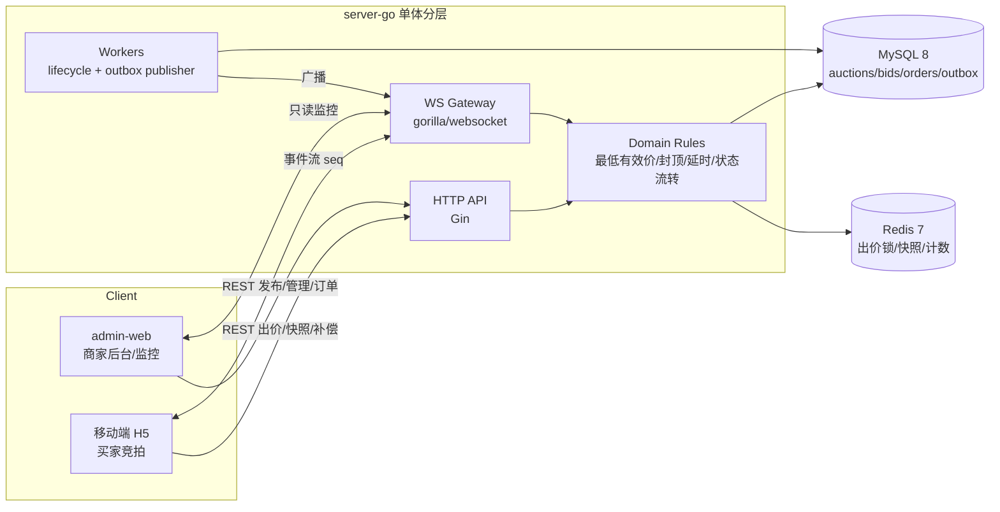
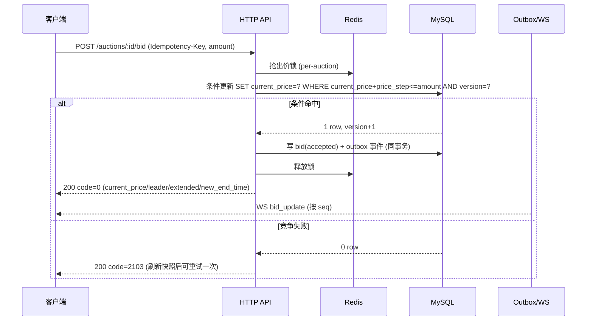
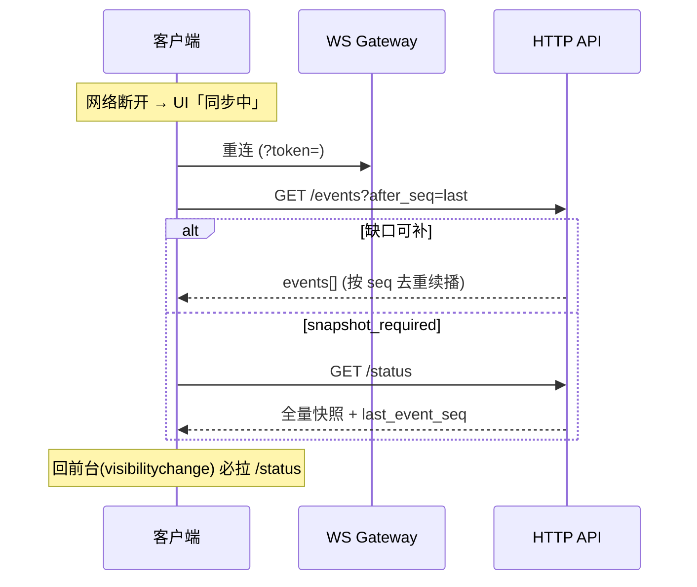

# 架构图与 README 首页描述

> 供答辩 PPT 第 2 页与根 `README.md` 首屏使用。mermaid 可在 Excalidraw/draw.io 重绘美化后导出 PNG。
> 注：以下为基于 `docs/contract-v2.md` 的整体描述，后端实现细节以 Role A 代码为准。

## 1. 系统架构

## 2. 出价时序（核心正确性）

## 3. WS 断线补偿时序

## 4. README 首页 outline（根 README 已含启动步骤，可补充以下小节）
1. 一句话价值 + 一张竞拍截图
2. 架构图（本文件 §1）
3. 技术亮点清单（链接到 `slides-outline.md`）
4. 启动步骤（已有：docker compose + 三端 + `dev-up.ps1`）
5. 目录说明（已有）
6. 团队分工入口（已有）
